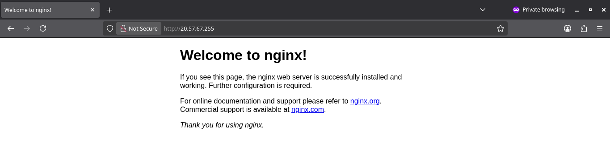
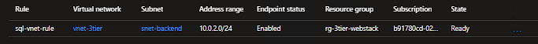
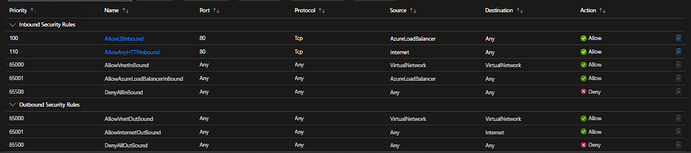
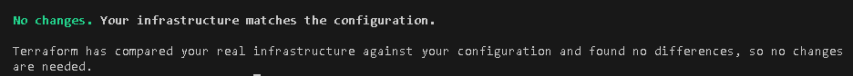

# Azure 3-Tier Network Infrastructure (IaC)

**Tech Stack:**    

## 🎯 Project Objective
This project serves as the foundational infrastructure for a secure, scalable 3-tier web application. My goal is to demonstrate professional-grade **Infrastructure as Code (IaC)** practices using Terraform while preparing for the **AZ-104 (Azure Administrator Associate)** exam in April.

---

## 🏗️ Architecture Design
The network follows a hub-and-spoke logic within a single Virtual Network, deployed in **East US 2** to ensure high availability and resource capacity.

- **VNet Address Space:** `10.0.0.0/16`
- **Subnets (/24):**
  - `snet-frontend`: Public-facing tier for the **Azure Standard Load Balancer**.
  - `snet-backend`: Private tier for **Virtual Machines** (Internal traffic only).
  - `snet-database`: Isolated tier for **Azure SQL** with Service Endpoints.
  - `snet-management`: Management tier for Admin/Jumpbox access.

---

## 🛡️ Security & Traffic Lockdown
I implemented a **Zero-Trust** approach by isolating each tier with dedicated **Network Security Groups (NSGs)** and **Virtual Network Service Endpoints**.

### Security Rules Implemented:
| Tier | NSG Name | Security Policy | Logic |
| :--- | :--- | :--- | :--- |
| **Frontend** | `nsg-frontend` | **AllowHTTPInbound** | **Port 80:** Allows traffic for the Load Balancer. |
| **Backend** | `nsg-backend` | **AllowLBInbound** | **Health Probes:** Allows Azure LB to monitor VM health. |
| **Backend** | `nsg-backend` | **AllowAnyHTTPInbound**| **Traffic Flow:** Permits user traffic from LB to private VMs. |
| **Database** | `nsg-database` | **AllowBackendSQL** | **Port 1433:** Only accepts TCP from the Backend subnet. |

---

## 📸 Proof of Concept & Verification
To validate the architecture, the following live tests were performed:

### 1. Web Tier Connectivity (Load Balancer)
  
*The Nginx "Welcome" page successfully served via the **Load Balancer's Public IP**, confirming healthy backend pool routing and NSG rule priority.*

### 2. Data Tier Isolation (SQL Networking)
  
*Azure SQL firewall configuration showing the **Virtual Network Rule** in place. This restricts database access exclusively to the private backend subnet via Service Endpoints.*

### 3. Traffic Lockdown (NSG Verification)
  
*Validation of the **Backend NSG**, demonstrating the specific allow-rules for the Azure Load Balancer and internal web traffic while maintaining a default-deny posture for unauthorized sources.*

### 4. IaC Idempotency & CI/CD
  
*Terminal output confirming **Idempotency** ("No changes. Your infrastructure matches the configuration") and a passing **GitHub Actions CI** run for linting and validation.*

---

## ✅ Phase 5: CI/CD Integration
- [x] Implemented GitHub Actions CI workflow for automated code validation.
- [x] Configured `terraform fmt` and `terraform validate` gates to ensure code quality.
- [x] Established a "Plan-Only" logic to demonstrate pipeline proficiency without incurring unnecessary cloud costs.

---

## 🧠 Lessons Learned & Troubleshooting
1. **Regional Capacity & Pivot:** Encountered `ProvisioningDisabled` in `eastus`. Successfully performed a regional migration to `eastus2`, learning that networking resources have "regional gravity" and must be recreated during a move.
2. **Infrastructure Integrity (State Reconciliation):** Managed "Inconsistent Result" errors by reconciling the local Terraform state with the Azure Portal using `terraform import`.
3. **Service Endpoint Scope:** Discovered that **Virtual Network Rules** for SQL require the **client subnet** (Backend) to have the `Microsoft.Sql` endpoint enabled, as the VMs initiate the connection.
4. **Standard LB Outbound Connectivity:** Learned that Standard SKU Load Balancers require an explicit **Outbound Rule** for private VMs to respond to Health Probes.
5. **SNAT Conflicts:** Resolved the `LoadBalancingRuleMustDisableSNAT` error by disabling outbound SNAT on the Load Balancing rule when using a dedicated Outbound Rule.
6. **Stateful vs. Stateless:** Mastered the logic of Azure's **Stateful** NSGs, eliminating the need for redundant outbound response rules.

---

## 🚀 How to Run Locally
1. **Clone:** `git clone https://github.com/johmcg/azure-3tier-project.git`
2. **Authenticate:** `az login`
3. **Initialize:** `terraform init`
4. **Apply:** `terraform apply`